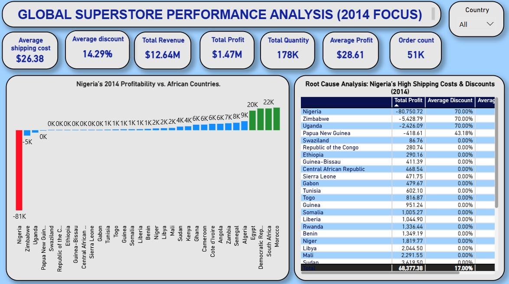
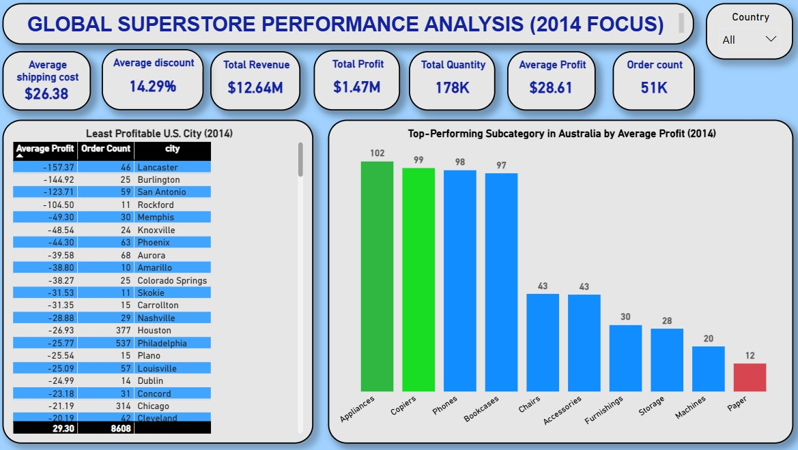

  

# GLOBAL SUPERSTORE SALES ANALYSIS

# INTRODUCTION
Global Superstore is a New York-based online retail giant offering over 10,000 products across Office Supplies, Furniture, and Technology. With a customer base in 147 countries, the company aims to be a one-stop shop for global buyers. This Project analyzes sales data from 2014 to uncover insights that can drive profitability, improve logistics, and guide strategic decision-making.

# PROBLEM STATEMENT
Despite its large product catalog and international reach, Global Superstore lacks clear visibility into performance variations across countries, product lines, and customer behavior. Leadership seeks to understand:

- What drives profitability?

- Why markets like Nigeria underperform?

- How to improve operational and sales outcomes globally?

# OBJECTIVE
To draw actionable insights from the 2014 sales data and provide data-driven recommendations to help Global Superstore improve its performance and profitability. The project specifically focuses on:

- Identifying profitable countries and products

- Analyzing shipping costs and discount impacts

- Evaluating regional and seasonal trends

- Suggesting strategies to optimize sales and operations

## TOOLS & SKILLS USED

- Power BI – For dashboarding, visualization, and DAX calculations
- Power Query – For data cleaning and transformation
- Excel – Initial exploration and cleanup
- DAX Measures – For creating KPIs like Total Profit, Average Discount, etc.

## PROJECT STRUCTURE

Global-Superstore-Sales-Analysis
│── README.md
├── Images
  ├── dashboard_1.jpg
  ├── dashboard_2.jpg
  └── dashboard_3.jpg

## Key Business Questions Answered

1. **Top 3 Countries by Total Profit (2014)**
   - Identified the highest-profit countries and their best-performing products.

2. **Highest Shipping Costs in the US**
   - Found the 3 subcategories with the highest average shipping costs.

3. **Nigeria’s Profitability in 2014**
   - Compared Nigeria’s performance to other African countries and investigated possible reasons (shipping costs and discounts).

4. **Least Profitable US City**
   - Analyzed cities with at least 10 orders and explained the lowest-performing city.

5. **Top Product Subcategory in Australia**
   - Identified the subcategory with the highest average profit.

# Global Superstore Sales Analysis (Power BI Project)

### Dashboard 1 – Global Sales Overview

  

**Key Visuals:**
- Map of Profit by Country  
- KPI Cards (Sales, Profit, Orders, Discount)  
- Sales and Profit by Category  

**Insights:**
- The USA, India, and China recorded the highest total profits.
- Total Revenue = $12.6M, Profit = $1.3M, Orders = 5,061, Average Discount = 15%.
- Technology consistently leads in both revenue and profitability.

**Recommendations:**
- Prioritize marketing and logistics in the top-performing countries.
- Evaluate the 15% average discount to ensure it's not impacting margins negatively.
- Expand technology offerings and bundle top-performing tech items.

### Dashboard 2 – Country & Subcategory Performance

  

**Key Visuals:**
- Profit by African Country  
- Average Shipping Cost by Subcategory (USA)  
- Least Profitable City (USA)  

**Insights:**
- Nigeria's total profit lags behind South Africa and Egypt.
- Copiers, Machines, and Binders had the highest shipping costs.
- Lancaster, PA had the lowest average profit among cities with 10+ orders.

**Recommendations:**
- Review Nigeria’s shipping and discount strategies for better efficiency.
- Consider logistics partnerships or regional warehouses to cut bulky item costs.
- Improve sales strategy and customer satisfaction in underperforming cities.

### Dashboard 3 – Seasonal & Regional Performance

  

**Key Visuals:**
- Monthly/Seasonal Sales Trends  
- Sales by U.S. Region  
- Top Subcategory Profit (Australia)  

**Insights:**
- Highest sales occurred between October and January.
- Eastern and Central U.S. regions drive the most revenue.
- Appliances lead in profitability in Australia.

**Recommendations:**
- Launch Q4-focused campaigns and prep inventory early.
- Use regional insights to guide marketing and inventory logistics.
- Promote appliances in Australia and expand product range.

## Key Findings

- The U.S., India, and China lead in profitability.
- Nigeria underperforms due to high shipping and discount rates.
- Technology and Appliances are the most profitable categories.
- Seasonal spikes occur in Q4 (Oct–Jan).
- Subcategories like Copiers and Machines have high shipping costs.

## Strategic Recommendations
- Reevaluate discount and shipping policies in low-profit countries.
- Focus marketing on top-performing regions and peak seasons.
- Lower bulky item logistics costs via regional partnerships.
- Improve tracking and engagement in weak markets (e.g., Lancaster, PA).
- Leverage high-margin subcategories (Technology, Appliances) for promotions.

## Conclusion
This Power BI project transformed complex sales data into clear, actionable business insights. By identifying performance patterns across regions, categories, and seasons, Global Superstore can now make more strategic, data-driven decisions that improve profitability and customer engagement.

**Created by:** *AMARACHI*  
**Capstone Project – Techrity Bootcamp (Data Analytics Track)**  
[LinkedIn Profile](https://www.linkedin.com/in/amarachi-florence)

